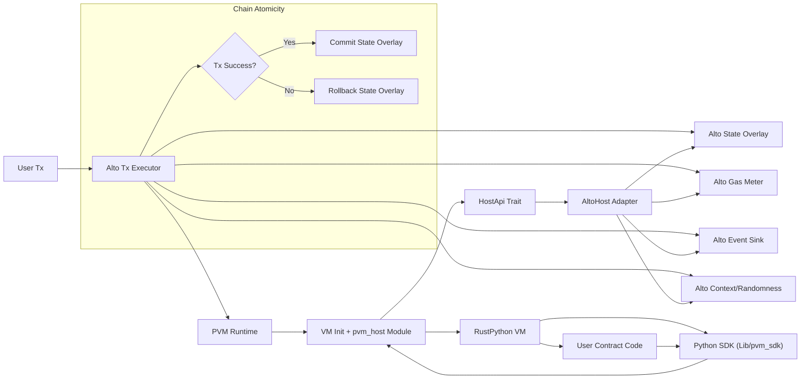

# PVM 与主链（Alto）低耦合对接方案

本文基于当前 PVM 代码形态（RustPython fork）整理一套可落地的低耦合方案，目标是：
- 主链每笔 TX 在交易内执行完成，保证区块内原子性。
- PVM 与主链解耦，便于未来持续同步 RustPython 上游。
- 支持后续 Actor/Continuation/Runner 机制逐步落地。

## 1. 约束与边界

### 1.1 执行约束
- 每笔 TX 必须在链上同步执行完毕，不跨区块悬挂。
- 所有非确定性输入必须通过 Host API 注入（时间、随机数、区块高度）。
- 不允许 PVM 直接访问主链内部类型或存储结构。

### 1.2 耦合边界
- PVM 核心不依赖 Alto 类型，不引入 Alto crate 依赖。
- Alto 仅通过 Host API 适配层对接 PVM。
- PVM 的 Python SDK 不直接绑定链接口，只调用 `pvm_host`。

## 2. 目录与模块拆分建议

建议将“链集成能力”从 RustPython fork 中剥离出来，并以小范围 patch 方式保留必要 hooks。

### 2.1 目录布局

- `crates/pvm-host`
  - 定义最小 Host API trait、类型、错误码
  - 只包含纯 Rust 类型，不依赖链实现

- `crates/pvm-runtime`
  - PVM 运行时包装器，初始化 VM 并注册 `pvm_host` 模块
  - 负责执行入口、加载/卸载 VM、桥接 Host API

- `Lib/pvm_sdk`
  - Python 侧 SDK，提供 `actor/runner/continuation` 语法糖
  - 只调用 `pvm_host` 模块，不直接绑定链侧细节

- `crates/pvm-alto`（可放 Alto repo 或此处）
  - 实现 `HostApi`，将 Alto 状态、事件、gas、区块上下文适配到 PVM

- `src/main.rs`（pvm binary）
  - 仅作为本地调试入口，调用 `pvm-runtime`
  - 链上执行使用库调用，不依赖该 binary

### 2.2 保持上游同步的策略
- 对 RustPython 核心修改尽量少，使用 `cfg(feature = "pvm")` 包裹。
- 所有 PVM 专用逻辑尽量放到 `pvm-runtime` 或 `pvm-host`。
- 保持清晰 patch 列表，使用 `git range-diff` 或 `format-patch` 管理上游同步。

## 3. Host API 设计（面向 Alto）

Host API 是 PVM 与链通信的唯一入口，使用最小抽象，避免链内部类型泄露。

### 3.1 核心类型

```rust
pub type Bytes = Vec<u8>;

#[derive(Clone, Debug)]
pub struct HostContext {
    pub block_height: u64,
    pub block_hash: [u8; 32],
    pub tx_hash: [u8; 32],
    pub sender: Bytes,
    pub timestamp_ms: u64,
}

#[derive(Clone, Debug)]
pub enum HostError {
    OutOfGas,
    InvalidInput,
    NotFound,
    StorageError,
    Forbidden,
    Internal,
}
```

### 3.2 HostApi trait（草案）

```rust
pub trait HostApi {
    // 状态读写
    fn state_get(&self, key: &[u8]) -> Result<Option<Bytes>, HostError>;
    fn state_set(&mut self, key: &[u8], value: &[u8]) -> Result<(), HostError>;
    fn state_delete(&mut self, key: &[u8]) -> Result<(), HostError>;

    // 事件与日志
    fn emit_event(&mut self, topic: &str, data: &[u8]) -> Result<(), HostError>;

    // Gas 计量
    fn charge_gas(&mut self, amount: u64) -> Result<(), HostError>;
    fn gas_left(&self) -> u64;

    // 上下文
    fn context(&self) -> HostContext;

    // 确定性随机数（可基于 VRF/链随机源）
    fn randomness(&self, domain: &[u8]) -> Result<[u8; 32], HostError>;
}
```

### 3.3 Alto 适配层（pvm-alto）

- 将 Alto 的状态树/存储接口映射到 `state_get/set/delete`。
- `emit_event` 写入 Alto 事件系统。
- `charge_gas` 使用 Alto 的 gas 计量接口。
- `context` 提供当前区块信息和交易信息。
- `randomness` 使用 Alto 的随机源或 VRF（必须确定性）。

## 4. PVM 运行时落地方案

### 4.1 `pvm-runtime` 执行入口

- 对外暴露库函数：

```rust
pub fn execute_tx(
    host: &mut dyn HostApi,
    code: &[u8],
    input: &[u8],
) -> Result<Bytes, HostError>;
```

- 运行流程：
  1. 初始化 VM，注册 `pvm_host` 模块。
  2. 将 `host` 绑定到 VM 的 native 模块。
  3. 执行脚本，期间所有链交互都通过 `pvm_host`。
  4. 捕获输出，返回给链上执行环境。

### 4.2 `pvm_host` Python 模块

提供最小 Python API：
- `get_state(key: bytes) -> bytes | None`
- `set_state(key: bytes, value: bytes)`
- `delete_state(key: bytes)`
- `emit_event(topic: str, data: bytes)`
- `charge_gas(amount: int)`
- `context() -> dict`
- `randomness(domain: bytes) -> bytes`

SDK 层仅依赖 `pvm_host`，不直接依赖 Alto。

## 5. 断点/Continuation 与链上原子性

- 当前链内每笔 TX 必须完整执行，不允许暂停挂起。
- Continuation 或断点恢复应当被视为“下一笔交易的输入”。
- 建议将 checkpoint 存储从文件 I/O 改为 Host 状态（`state_set`）。
- 对于 Runner/异步任务，链上执行完成后写入 continuation state，下一笔 TX 恢复执行。

## 6. 与 RustPython 上游同步的最小侵入策略

### 6.1 修改边界
- 核心 VM 不引入 Alto 依赖。
- 必要 hooks 使用 `cfg(feature = "pvm")` 包裹。
- PVM 功能尽量放入新 crate 或新增模块，而非修改既有 VM 逻辑。

### 6.2 同步策略
- 维护 `upstream` 远程，定期 rebase/merge。
- 为 PVM 改动维护独立 patch 目录（如 `patches/`）。
- 优先使用外部 crate 注入能力，减少修改上游文件。

## 7. 分阶段落地计划

### 阶段 1：Host API 与 Runtime
- 实现 `crates/pvm-host` 与 `crates/pvm-runtime`。
- 生成 `pvm_host` 模块并可被 Python 调用。
- 本地 pvm binary 调用 `execute_tx`。

### 阶段 2：Alto 适配
- 在 Alto 侧实现 `HostApi`。
- 将 PVM 作为库嵌入 Alto 交易执行流程。

### 阶段 3：Gas 与 Determinism
- 增加 VM 层或字节码级 gas hooks。
- 固定 hash seed、限制非确定性行为。

### 阶段 4：Actor/Continuation
- SDK 侧引入 Actor/Continuation 语法糖。
- 将 continuation 状态存入链上（Host state）。

## 8. 风险与注意事项

- Host API 必须保持稳定，避免 SDK/VM 与链升级频繁冲突。
- 若引入 async/continuation，必须严格保证跨区块确定性。
- 将 `pvm_host` 定义为唯一链交互入口，避免绕过 Host。

---

如需进一步落地，我可以提供：
- `pvm-host` 的具体代码骨架与错误码设计
- `pvm-runtime` 的执行入口实现
- Alto 对接适配层草案与执行流程示例

## 9. Alto 侧实现骨架（代码草案）

以下为基于 Alto 的 HostApi 适配骨架示例。具体 Alto 类型名需替换为实际实现，但结构建议保持一致。

### 9.1 Alto 侧 crate 布局（建议）

- `crates/pvm-alto`
  - `lib.rs`：对外入口，执行 TX 并调用 PVM
  - `host.rs`：`HostApi` 实现
  - `error.rs`：HostError <-> AltoError 映射
  - `types.rs`：上下文与数据结构封装

### 9.2 AltoHost 结构与 HostApi 实现

```rust
use pvm_host::{Bytes, HostApi, HostContext, HostError};

// Alto 侧交易执行上下文（示意）
pub struct AltoTxContext<'a> {
    pub block_height: u64,
    pub block_hash: [u8; 32],
    pub tx_hash: [u8; 32],
    pub sender: Bytes,
    pub timestamp_ms: u64,
    pub state: &'a mut AltoStateOverlay,
    pub events: &'a mut AltoEventSink,
    pub gas: &'a mut AltoGasMeter,
    pub randomness: &'a AltoRandomness,
}

pub struct AltoHost<'a> {
    ctx: &'a mut AltoTxContext<'a>,
}

impl<'a> AltoHost<'a> {
    pub fn new(ctx: &'a mut AltoTxContext<'a>) -> Self {
        Self { ctx }
    }
}

impl HostApi for AltoHost<'_> {
    fn state_get(&self, key: &[u8]) -> Result<Option<Bytes>, HostError> {
        self.ctx
            .state
            .get(key)
            .map_err(|_| HostError::StorageError)
    }

    fn state_set(&mut self, key: &[u8], value: &[u8]) -> Result<(), HostError> {
        self.ctx
            .state
            .set(key, value)
            .map_err(|_| HostError::StorageError)
    }

    fn state_delete(&mut self, key: &[u8]) -> Result<(), HostError> {
        self.ctx
            .state
            .delete(key)
            .map_err(|_| HostError::StorageError)
    }

    fn emit_event(&mut self, topic: &str, data: &[u8]) -> Result<(), HostError> {
        self.ctx
            .events
            .emit(topic, data)
            .map_err(|_| HostError::Internal)
    }

    fn charge_gas(&mut self, amount: u64) -> Result<(), HostError> {
        self.ctx.gas.charge(amount).map_err(|_| HostError::OutOfGas)
    }

    fn gas_left(&self) -> u64 {
        self.ctx.gas.remaining()
    }

    fn context(&self) -> HostContext {
        HostContext {
            block_height: self.ctx.block_height,
            block_hash: self.ctx.block_hash,
            tx_hash: self.ctx.tx_hash,
            sender: self.ctx.sender.clone(),
            timestamp_ms: self.ctx.timestamp_ms,
        }
    }

    fn randomness(&self, domain: &[u8]) -> Result<[u8; 32], HostError> {
        self.ctx
            .randomness
            .derive(domain)
            .map_err(|_| HostError::Internal)
    }
}
```

### 9.3 Alto 交易执行入口（示意）

```rust
use pvm_runtime::execute_tx;
use pvm_host::HostError;

pub fn execute_pvm_tx(tx: &AltoTx, ctx: &mut AltoTxContext) -> Result<AltoReceipt, AltoError> {
    // 1. 创建 Host 适配
    let mut host = AltoHost::new(ctx);

    // 2. 调用 PVM 执行
    let output = execute_tx(&mut host, &tx.code, &tx.input)
        .map_err(|e| map_host_err(e))?;

    // 3. 按 Alto 规范处理返回值
    Ok(AltoReceipt { output })
}

fn map_host_err(err: HostError) -> AltoError {
    match err {
        HostError::OutOfGas => AltoError::OutOfGas,
        HostError::InvalidInput => AltoError::InvalidTx,
        HostError::StorageError => AltoError::StorageFailure,
        _ => AltoError::ExecutionFailure,
    }
}
```

### 9.4 状态隔离与原子性

为满足“每笔 TX 内完整执行”的要求，建议 Alto 使用可回滚的 state overlay：
- `AltoStateOverlay` 记录写集；
- PVM 成功执行则 commit；
- 执行失败或异常则 rollback。

### 9.5 Gas 计量建议

- 初期可使用 Host 层粗粒度计量（每次 `state_get/set`、`emit_event` 等消耗固定 gas）。
- 后续如需细粒度，可在 VM 指令执行处增加 hook，并通过 Host API 扣费。

## 10. 系统架构图（Mermaid）


