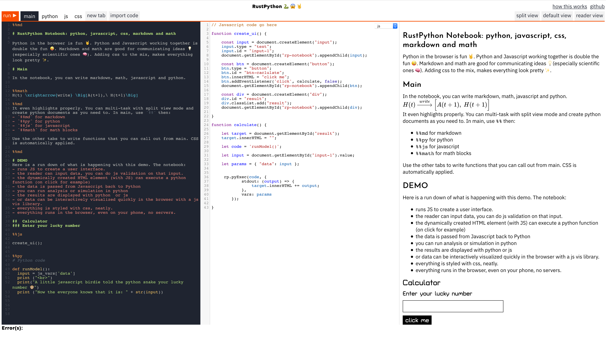

# RustPython Notebook

The RustPython Notebook is a **toy** notebook inspired by the now inactive Iodide project ([https://alpha.iodide.io/](https://alpha.iodide.io/)).

Here is how it looks like:



You can use the notebook to experiment with using Python and Javascript in the browser together.

The main use case is for scientific communication where you can have:

-   text or thesis in markdown,
-   math with Tex,
-   a model or analysis written in python,
-   a user interface and interactive visualization with JS.

The Notebook loads python in your browser (so you don't have to install it) then let yous play with those languages.

Using Javascript in the browser can play to JS strength but it is also a workaround since RustPython doesn't fully implement DOM/WebAPI functionality.

To read more about the reasoning behind certain features, check the blog on [https://rustpython.github.io/blog](https://rustpython.github.io/blog)

## Sample notebooks

Sample notebooks are under `snippets`

-   `snippets/python-markdown-math.txt`: python, markdown and math
-   `snippets/python-js.txt`, adds javascript
-   `snippets/python-js-css-md/` adds styling with css in separate, more organized files.

## How to use

-   Run locally with `npm run dev`
-   Build with `npm run dist`

## JS API

```typescript
// adds `values[name]` to the python scope under `name`
function injectPython(values: { [name: string]: PythonValue });
type PythonValue =
    // null -> None
    | null
    | undefined
    // n -> int(n) if Number.isInteger(n) else float(n)
    | number
    // s -> str(s)
    | string
    // typedArray -> bytes(typedArray)
    | Uint8Array
    // arr -> list(arr)
    | Array<PythonValue>
    // obj -> dict(Object.entries(obj))
    | { [k: string]: PythonValue }
    // js callback in python: positional args are passed as
    // arguments, kwargs is the `this` variable
    // f -> lambda *args, **kwargs: f.apply(kwargs, args)
    //
    // python callback in js: pass the positional args an array and
    // kwargs as an object
    // f -> (args, kwargs) => f(*args, **kwargs)
    | Function;

// appends an element to the notebook
function pushNotebook(el: HTMLElement);

// find and displays the traceback of a python error from a callback
function handlePyError(err: any);
// e.g.
try {
    pyCb([], {});
} catch (err) {
    handlePyError(err);
}
```

`injectPython` demo:

```js
injectPython({
    foo(a, b) {
        console.log(a);
        if (this.x != null) {
            console.log(`got kwarg! x=${this.x}`);
        }
        return (y) => y + 1 + b;
    },
});
```

```py
adder = foo("hy from python", 3, x=[1, 2, 3])
assert adder(5) == 9
```

## Wish list / TO DO

-   Collaborative peer-to-peer editing with WebRTC. Think Google Doc or Etherpad editing but for code in the browser
-   `%%load` command for dynamically adding javascript libraries or css framework
-   Clean up and organize the code. Seriously rethink if we want to make it more than a toy.
